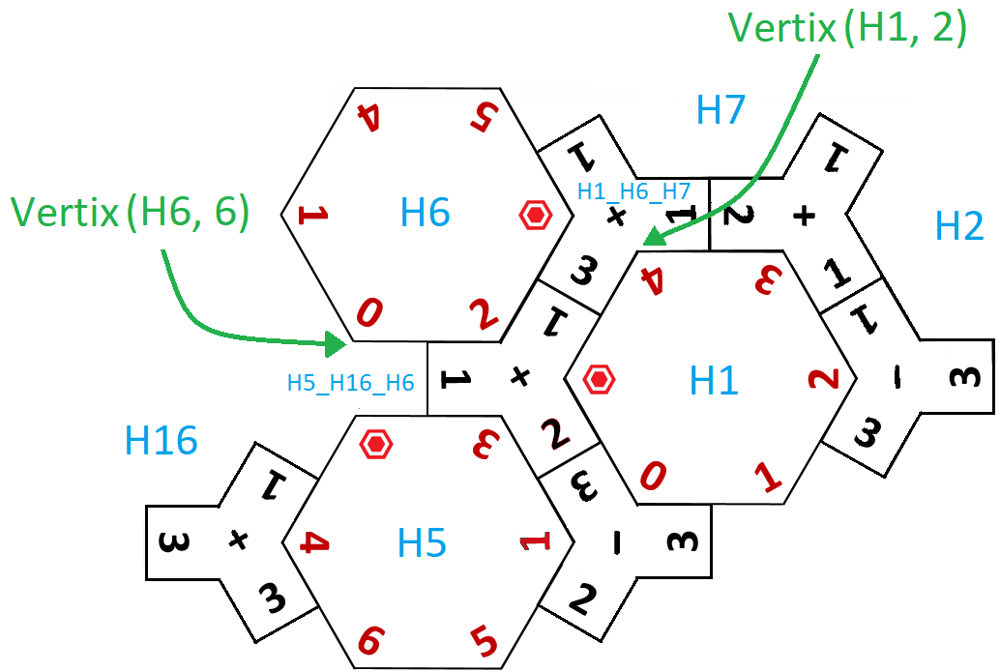

<h2>
	What is iwoki Maths?
</h2>

	Iwoki Maths, hereinafter iwoki, is an abstract board game for laying tiles. It combines the calculation of simple mathematical operations with the spatial perception of two-dimensional objects.	

	</img>
	 Fig. 1: Example of an iwoki game. 

<h2>
	Game component modeling
</h2>

	The implementation of the small and hexagonal tiles, the gaps where they can be placed and the common attributes and methods of the players (scoring, red and white tokens, action of placing or drawing tiles, etc.), has been carried out according to the following class diagram.

	</img>
	 Fig. 2: Class diagram. 

	In order to understand how the agents act, it is necessary to know how the tiles and the virtual board are modelled.

<h4>
	Hexagonal tile
</h4>

	All 12 possible variants of each hexagonal tile are taken into account, according to the orders they can present (6 for each side).

	</img>
	 Fig. 3: Hexagonal tile. 

<h4>
	Small tile
</h4>

	All the 6 possible variants of each small tile are taken into account, according to the orders that it can present (3 for each side).

	</img>
	 Fig. 4: Small tile. 

	Before explaining the HexagonalGap and SmallGap clases, it is necessary to make clear how the tiles are placed throughout the game.

	As shown in Figure 1, physical iwoki does not require any board on which to place the tiles. To be able to correlate the tiles, a virtual board like the one shown below is modelled. It defines a set of fixed gaps, where the small and hexagonal tiles will be placed in a fictitious way.

	</img>
	 Fig. 5: Virtual board. 

	All of these gaps are uniquely identified.

	Each vertex of the board is common to a hexagonal tile and a small one. It is identified by the coordinates (A, B), where:
	<ul>
		<li type="disc">A: Hexagonal gap identifier, shown in Figure 6 in black (H1, H6, H7, etc.).</li>
		<li type="disc">B: Order number of the vertex of the gap A. This number (from 1 to 6) will be one of those represented in blue in Figure 6.</li>
	</ul>

	</img>
	 Fig. 6: Identification of the gaps and their coordinates. 

	This figure is used to explain the following example:
	<ul>
		<li type="disc">The 6 vertices of the gap H1 have the coordinates (H1, 1), (H1, 2), (H1, 3), (H1, 4), (H1, 5) and (H1, 6).</li>
		<li type="disc">The small gap, identified by H1_H5_H6, is in the middle of the hexagonal gaps H1, H5 and H6 (hence its identifier). Its three inner vertices have the coordinates (H1, 1), (H5, 3) and (H6, 5).</li>
		<li type="disc">That is, the small tile´s gap H1_H5_H6 has in common with the hexagonal gap H1 the coordinates (H1, 1), with the gap H5 the coordinates (H5, 3) and with the H6 the coordinates (H6, 5).</li>
	</ul>

	Continuing now in Figure 7, suppose that the small tile [1, 1, 2, +], shown darker than the others, is placed in the gap H1_H5_H6. The coordinates of the vertices of that gap take the following values:

	(H6, 5) --> 2 (result of 1 + 1)
	 (H1, 1) --> 3 (result of 1 + 2)
	 (H5, 3) --> 3 (result of 2 + 1)

	</img>
	 Fig. 7: Example of placing a small tile [1, 1, 2, +] in the gap H1_H5_H6. 

	That is, as you can see, the hexagonal tile located in the gap H6 has been assigned in its vertex 5 the number 2. Therefore, the small tile may cover that vertex with the result of the sum 1 + 1, in the coordinates (H6, 5). Similarly, the result of the addition 2 + 1 can be linked to the hexagon at position H5 by the coordinate vertex (H5, 3). Finally, the result of 1 + 2 is compatible with the wildcard, in the vertex of coordinates (H1, 1). The system can therefore consider the placement of this small tile in gap H1_H5_H6 as valid.

	Let's see below how the gaps that make up the virtual board are modelled.

<h4>
	Hexagonal gap
</h4>

	This is the class that represents a gap in the virtual board reserved for a hexagonal tile. The vertices attribute defines a list of 6 elements, each corresponding to a vertex of the hexagon. Each vertex includes the following information:
	<ul>
		<li type="disc">Hexagonal gap identifier (H1, H2, etc.).</li>
		<li type="disc">Vertex order number (from 1 to 6).</li>
		<li type="disc">Number assigned to the vertex.</li>
		<li type="disc">Vertex occupancy status indicator ('O' Occupied; 'V' Vacant).</li>
	</ul>

	‘O' indicates that the hexagonal gap' vertex is covered by a tile.
	 
	‘V' means that, although there is not yet a hexagonal tile covering that gap, the vertex is already assigned a number because there is a small tile in the adjacent gap.

	In the example shown in Figure 8, it can be seen that hole H1 is occupied by a hexagonal tile. The vertex (H1, 6) has value 0 (result of subtraction 3 - 3) and its occupation status is 'O' (Occupied).

	On the other hand, although the H2 gap is not occupied by any hexagonal tile, the vertex (H2, 1) has value 2 (result of the sum 1 + 1). The occupation status of this vertex is 'V' (Vacant).

	</img>
	 Fig. 8: Vertices of hexagonal gaps. 

<h4>
	Samll gap
</h4>

	This is the class used to implement the gaps in the virtual board reserved for small tiles. The vertices attribute implements a list of 3 elements that correspond to the inner vertices of the gap. Analogous to the hexagonal tile, the information contained in each vertex of a small tile is as follows:
	<ul>
		<li type="disc">Identifier of the adjacent hexagonal gap (H1, H2, etc.).</li>
		<li type="disc">Order number of the vertex of the adjacent hexagonal gap (from 1 to 6).</li>
		<li type="disc">Number assigned to the vertex.</li>
		<li type="disc">Vertex occupancy status indicator ('O' Occupied; 'V' Vacant).</li>
	</ul>

	In the example of Figure 9 it can be seen that the gap H1_H6_H7 is occupied by a small tile. The vertex (H1, 2) has value 4 (result of the sum 3 + 1) and its occupation status is 'O' (Occupied).

	On the other hand, although the hexagon gap H5_H16_H6 is not occupied by any small tiles, the vertex (H6, 5) has the value 0 imposed by the hexagonal tile in the H6 gap. The occupation status of this vertex is 'V' (Vacant).

	</img>
	 Fig. 9: Vertices of small gaps. 

